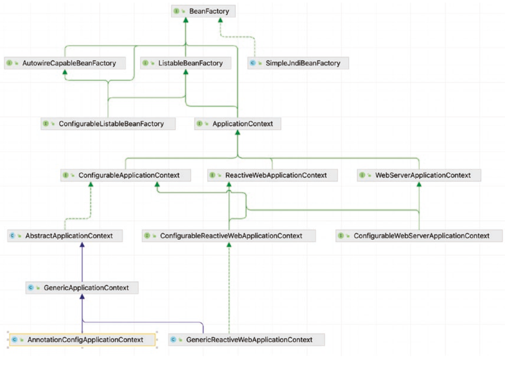
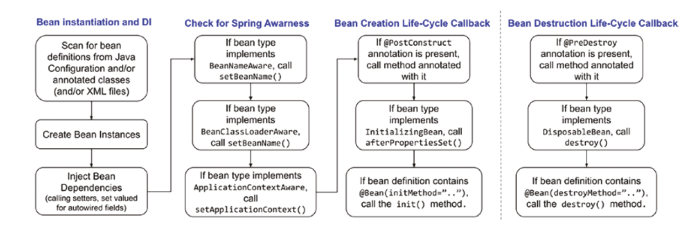

= Pro Spring 6

== Links

- https://github.com/Apress/pro-spring-6[GitHub Books page]

.Spring Framework detailed Modules
[%header,cols=2*]
|===
|Module
|Description

|aop
|This module contains all the classes you need to use Spring’s AOP features within your
application. You also need to include this JAR in your application if you plan to use other
features in Spring that use AOP, such as declarative transaction management. Moreover,
classes that support integration with AspectJ are packed in this module.

|aspects
|This module contains all the classes for advanced integration with the AspectJ AOP library.
For example, if you are using Java classes for your Spring configuration and need AspectJstyle annotation-driven transaction management, you need this module.
|beans
|This module contains all the classes for supporting Spring’s manipulation of Spring beans.
Most of the classes here support Spring’s bean factory implementation. For example, the
classes required for processing the Spring XML configuration file and Java annotations are
packed into this module.
|context
|This module contains classes that provide many extensions to Spring Core. You will find that
all classes need to use Spring’s ApplicationContext feature (covered in Chapter 5), along
with classes for Enterprise JavaBeans (EJB), Java Naming and Directory Interface (JNDI), and
Java Management Extensions (JMX) integration. Also contained in this module are the Spring
remoting classes, classes for integration with dynamic scripting languages (for example,
JRuby, Groovy, and BeanShell), JSR-303 (“Bean Validation”), scheduling and task execution,
and so on.
|context-indexer
|This module contains an indexer implementation that provides access to the candidates that
are defined in META-INF/spring.components. The core class CandidateComponentsIndex is
not meant to be used externally.
|context-support
|This module contains further extensions to the spring-context module. On the userinterface side, there are classes for mail support and integration with templating engines
such as Velocity, FreeMarker, and JasperReports. Also, integration with various task execution
and scheduling libraries, including CommonJ and Quartz, are packaged here.
|core
|This is the main module that you will need for every Spring application. In this JAR file, you
will find all the classes that are shared among all other Spring modules (for example, classes
for accessing configuration files). Also, in this JAR you will find selections of extremely useful
utility classes that are used throughout the Spring codebase and that you can use in your own
application.
|expression
|This module contains all support classes for Spring Expression Language (SpEL).
|instrument
|This module includes Spring’s instrumentation agent for JVM bootstrapping. This JAR file is
required for using load-time weaving with AspectJ in a Spring application.
|jcl
|This module is only present for binary compatibility with existing Commons Logging usage,
such as in Apache Commons Configuration.
|jdbc
|This module includes all classes for JDBC support. You will need this module for all
applications that require database access. Classes for supporting data sources, JDBC data
types, JDBC templates, native JDBC connections, and so on, are packed in this module.
|jms
|This module includes all classes for Java Message Service (JMS) support.
|messaging
|This module contains key abstractions taken from the Spring Integration project to serve as
a foundation for message-based applications and adds support for Simple or Streaming Text
Orientated Messaging Protocol (STOMP) messages.
|orm
|This module extends Spring’s standard JDBC feature set with support for popular ORM
tools including Hibernate, JDO, and JPA. Many of the classes in this JAR depend on classes
contained in the spring-jdbc JAR file, so you definitely need to include that in your
application as well.
|oxm
|This module provides support for Object/XML Mapping (OXM). Classes for the abstraction
of XML marshalling and unmarshalling and support for popular tools such as Castor, JAXB,
XMLBeans, and XStream are packed into this module.
|r2dbc
|This module makes R2DBC easier to use and reduces the likelihood of common errors. It
provides simple error handling and a family of unchecked concise exceptions agnostic of the
underlying Reactive Database Manager (RDBM)
|test
|Spring provides a set of mock classes to aid in testing your applications, and many of
these mock classes are used within the Spring test suite, so they are well tested and
make testing your applications much simpler. Certainly we have found great use for the
mock HttpServletRequest and HttpServletResponse classes in unit tests for our
applications. On the other hand, Spring provides a tight integration with the JUnit unittesting framework, and many classes that support the development of JUnit test cases are
provided in this module; for example SpringExtension integrates the Spring TestContext
Framework into JUnit 5’s Jupiter programming model.
|tx
|This module provides all classes for supporting Spring’s transaction infrastructure. You will
find classes from the transaction abstraction layer to support the Java Transaction API (JTA)
and integration with application servers from major vendors.
|web
|This module contains the core classes for using Spring in your web applications, including
classes for loading an ApplicationContext feature automatically, file upload support classes,
and a bunch of useful classes for performing repetitive tasks such as parsing integer values
from the query string.
|webflux
|This module contains core interfaces and classes for the Spring Web Reactive model.
|webmvc
|This module contains all the classes for Spring’s own MVC framework. If you are using a
separate MVC framework for your application, you won’t need any of the classes from this
JAR file.
|websocket
|This module provides support for JSR-356 (“Java API for WebSocket”).
|===

.Spring Boot Framework detailed Modules
[%header,cols=2*]
|===
|Module
|Description
|spring-boot-starter
|This is the simplest Spring Boot starter that adds the spring-core
library as a dependency for your project. It can be used to create a very
simple Spring application. It is used mostly for learning purposes and
for creating base projects, and encapsulates common functionality
shared among other modules in a project.
|spring-boot-starter-aop
|Adds the spring-aop library as a dependency for your project.
|spring-boot-starter-data-*
|This type of starter adds various Spring dependencies for working with
data in your project. The * replaces the technology from which data is
coming. For example, spring-boot-starter-data-jdbc adds classes
for creating Spring Repository beans for handling data from databases
supporting a JDBC driver: MySQL, PostgreSQL, Oracle, etc.
|spring-boot-starter-web
|Configures minimal dependencies for creating a web application.
|spring-boot-starter-security
|Configures minimal dependencies for securing a Spring web
application.
|spring-boot-starter-webflux
|Configures minimal dependencies for creating a reactive web
application.
|spring-boot-starter-actuator
|Configures the Spring Boot Actuator, which enables a set of endpoints
for monitoring a Spring web application.
|spring-boot-starter-test
|Configures the following set of libraries: Spring Test, JUnit, Hamcrest,
and Mockito.
|===

.Spring Boot BOM
[source,xml]
----
<dependencyManagement>
    <dependencies>
      <dependency>
        <groupId>org.springframework.boot</groupId>
        <artifactId>spring-boot-dependencies</artifactId>
        <version>${springboot.bom-version}</version>
        <type>pom</type>
        <scope>import</scope>
      </dependency>
    </dependencies>
</despendencyManagement>
----

* Using SpringLoader is the Java way of using dependency injection in your application and removes the necessity of writing all that glue code

* Injection vs.
Lookup: The biggest reason to choose injection over lookup is that it makes your life easier, you write substantially less code when you are using injection

* Constructor injection also helps achieve the use of immutable objects

=== Inversion Of Control Spring

* Inversion of control is a big part of what Spring does, the core of Spring’s implementation is based on dependency injection, although dependency lookup features are provided as well

=== Beans and BeanFactory

.Bean-factory common implementations

* The _org.springframework.beans_ and _org.springframework.context_ packages are the basis for Spring Framework’s IoC container.
* In developing Spring-based applications, it’s recommended that you interact with Spring via the ApplicationContext interface

* Stereotypes in Spring are, @Service is used to define a service bean, which is a more complex functional bean that provides services that other beans may require, and @Repository is used to define a bean that is used to retrieve/save data from/to a database.
And @Component is the annotation that marks a class as a bean declaration.
@Component is a meta-annotation

* Component scanning is a time-consuming operation, and it is good programming practice to try to limit the places where Spring will look for bean definitions in the codebase, from legacy code we ca use bean definitions from an XML file (or more) using @ImportResource

* Spring supports use of the @Inject annotation introduced as part of JSr-299 (“Contexts and dependency Injection for the Java EE platform”), later moved to JSr-330 (“dependency Injection for Java”).
@Inject is equivalent in behavior to Spring’s @Autowired annotation and currently is part of the jakarta.inject-api library.

.Using Qualifier and Autowired
[source,java]
----
@Configuration
class MyClass {
  @Bean
  List<Song> list() {
    return List.of(new Song("Not the End"), new Song("Rise up"));
  }

  @Bean Song songOne() {}
}
@Component
class MyOtherClass {
  @Autowired
  @Qualifier("list") // list Bean
  List<Song> songs;
}

----

.Bean name Customization
[source,java]
----
@Configuration
@ComponentScan(nameGenerator = SimpleBeanNameGenerator.class)
class BeanNamingCfg {
}
class SimpleBeanNameGenerator extends AnnotationBeanNameGenerator {
@Override
protected String buildDefaultBeanName(BeanDefinition definition, BeanDefinitionRegistry
registry) {
var beanName = definition.getBeanClassName().substring(definition.
getBeanClassName().lastIndexOf(".") + 1).toLowerCase(Locale.ROOT);
var uid = UUID.randomUUID().toString().replace("-","").substring(0,8);
return beanName + "-" + uid;
}
}
----

=== Instantiation Mode

. In general, singletons should be used in the following scenarios:
• Shared object with no state: You have an object that maintains no state and has many dependent objects.
Because you do not need synchronization if there is no state, you do not need to create a new instance of the bean each time a dependent object needs to use it for some processing.
• Shared object with read-only state: This is similar to the previous point, but you have some read-only state.
In this case, you still do not need synchronization, so creating an instance to satisfy each request for the bean is just adding overhead.
• Shared object with shared state: If you have a bean that has state that must be shared, singleton is the ideal choice.
In this case, #_ensure that your synchronization for state writes is as granular as possible_#.
• High-throughput objects with writable state: If you have a bean that is used a great deal in your application, you may find that keeping a singleton and synchronizing all write access to the bean state allows for better performance than constantly creating hundreds of instances of the bean.
When using this approach, try to keep the synchronization as granular as possible without sacrificing consistency.
You will find that this approach is particularly useful when your application creates a large number of instances over a long period of time, when your shared object has only a small amount of writable state, or when the instantiation of a new instance is expensive.

. You should consider using non-singletons in the following scenarios:
• Objects with writable state: If you have a bean that has a lot of writable state, you may find that the cost of synchronization is greater than the cost of creating a new instance to handle each request from a dependent object.
• Objects with private state: Some dependent objects need a bean that has private state so that they can conduct their processing separately from other objects that depend on that bean.
In this case, singleton is clearly not suitable, and you should use nonsingleton.

=== Beans Life Cycle

.Beans Life Cycle

=== InitializingBean Interface

* The InitializingBean interface defined in Spring allows you to define inside your bean code for Spring to execute after it has finished configuring the bean

.All Init methods
[source,bash]
----
DEBUG: DefaultSingletonBeanRegistry - Creating shared instance of singleton bean 'org.
springframework.context.annotation.internalConfigurationAnnotationProcessor'
DEBUG: DefaultSingletonBeanRegistry - Creating shared instance of singleton bean 'org.
springframework.context.event.internalEventListenerProcessor'
DEBUG: DefaultSingletonBeanRegistry - Creating shared instance of singleton bean 'org.
springframework.context.event.internalEventListenerFactory'
DEBUG: DefaultSingletonBeanRegistry - Creating shared instance of singleton bean 'org.
springframework.context.annotation.internalAutowiredAnnotationProcessor'
DEBUG: DefaultSingletonBeanRegistry - Creating shared instance of singleton bean 'org.
springframework.context.annotation.internalCommonAnnotationProcessor'
DEBUG: DefaultSingletonBeanRegistry - Creating shared instance of singleton bean
'multiInitConfiguration'
DEBUG: DefaultSingletonBeanRegistry - Creating shared instance of singleton bean
'dependency'
DEBUG: DefaultSingletonBeanRegistry - Creating shared instance of singleton bean
'multiInitBean
[INFO] Running com.apress.springfulls.journey.procore.chapter04.AppTest
2023-11-06 13:56:12.092 INFO  main [ c.a.s.j.p.c.f.MultiInit  ]
        - 1. Calling constructor for bean of type class com.apress.springfulls.journey.procore.chapter04.full.MultiInit.
2023-11-06 13:56:12.109 INFO  main [ c.a.s.j.p.c.f.MultiInit  ]
        - 2. Calling setDependency for bean of type class com.apress.springfulls.journey.procore.chapter04.full.MultiInit.
2023-11-06 13:56:12.109 INFO  main [ c.a.s.j.p.c.f.MultiInit  ]
        - 3. Calling postConstruct() for bean of type class com.apress.springfulls.journey.procore.chapter04.full.MultiInit.
2023-11-06 13:56:12.110 INFO  main [ c.a.s.j.p.c.f.MultiInit  ]
        - 4. Calling afterPropertiesSet() for bean of type class com.apress.springfulls.journey.procore.chapter04.full.MultiInit.
2023-11-06 13:56:12.110 INFO  main [ c.a.s.j.p.c.f.MultiInit  ]
        - 5. Calling initMethod() for bean of type class com.apress.springfulls.journey.procore.chapter04.full.MultiInit.
----

IMPORTANT: The name of the method _destroySingletons()_ gives a hint about an important detail.
Spring only performs bean destruction for singleton beans.
Beans with other scopes than singleton do not have their life cycle fully managed by Spring. for example, for prototype beans, the Spring container instantiates, configures, and otherwise assembles a prototype object, and hands it to the client, with no further record of that prototype instance

* Using the _ApplicationContextAware_ interface, it is possible for your beans to get a reference to the ApplicationContext instance that configured them.
You should, however, avoid this practice and use dependency injection to provide your beans with their collaborators

* Spring provides the _FactoryBean_ interface that acts as an adapter for objects that cannot be created and managed using the standard Spring semantics.

WARNING: Spring automatically calls the getObject() method; it is a bad practice call that method manually

* A feature of ApplicationContext not present in BeanFactory is the ability to publish and receive events by using ApplicationContext as a broker

.Different Testing Categories Used in Practice
[%header,cols=3*]
|===
|Test Category
|Description
|Common Tools

|Logic unit test
|A logic unit test takes a single object and tests it by itself,
without worrying about the role it plays in the surrounding
system.
|Unit test: JUnit, TestNG;
Mock objects: Mockito,
EasyMock

|Integration
unit test
|An integration unit test focuses on testing the interaction
between components in a “near real” environment. These
tests exercise the interactions with the container (embedded
database, web container, and so on).
|Embedded database: H2;
Database testing: DbUnit;
In-memory web container:
Jetty

|Front-end
unit test
|A front-end unit test focuses on testing the user interface. The
objective is to ensure that each user interface reacts to users’
actions and produces output to users as expected.
|Selenium, Cypress

|Continuous
build and
code quality
test
|The application code base should be built on a regular basis
to ensure that the code quality complies with the standard
(for example, comments are all in place, no empty exception
catch block, and so on). Also, test coverage should be as high
as possible to ensure that all developed lines of codes are
tested.
|Code quality: PMD, Checkstyle,
FindBugs, Sonar;
Test coverage: Cobertura,
EclEmma; Build tool:
Gradle, Maven; Continuous
build: Hudson, Jenkins

|System
integration
test
|A system integration test verifies the accuracy of
communication among all programs in the new system
and between the new system and all external interfaces.
The integration test must also prove that the new system
performs according to the functional specifications and
functions effectively in the operating environment without
adversely affecting other systems.
|IBM Rational Functional
Tester, HP Unified
Functional Testing

|System quality test
|system quality test ensures that the developed application meets those nonfunctional requirements. Most of the time, this tests the performance of the application to ensure that the target requirements for concurrent users of the system and workload are met. Other nonfunctional requirements include security, high-availability features, and so on.
|Apache JMeter, HP LoadRunner, Locust, K6

|User acceptance test
|A user acceptance test simulates the actual working conditions of the new system, including the user manuals and procedures. Extensive user involvement in this stage of testing provides the user with invaluable training in operating the new system. It also benefits the programmer or designer to see the user experience with the new programs. This joint involvement encourages the user and operations personnel to approve the system conversion.
|IBM Rational TestManager, HP Quality Center

|===

.Spring specialized test annotations
[%header,cols=2*]
|===
|Annotation
|Description

|@BootstrapWith
|Class-level annotation used to determine how to bootstrap the Spring TestContext Framework.

|@ContextConfiguration
|Class-level annotation used to determine how to load and configure an ApplicationContext for integration tests.
When using Junit 4, annotation test classes need to be
annotated with @RunWith(SpringRunner.class). When
using Junit Jupiter, test classes need to be annotated with
@ExtendWith(SpringExtension.class).

|@WebAppConfiguration
|Class-level annotation used to indicate the ApplicationContext loaded should be a WebApplicationContext.

|@ContextHierarchy
|Class-level annotation used to define a hierarchy of ApplicationContexts for integration tests.

|@DirtiesContext
|Class- and method-level annotation used to indicate that the context has been modified or corrupted in some way during the execution of the test and should be closed and rebuilt for subsequent tests.

|@ActiveProfiles
|Class-level annotation indicating which bean profile should be active.

|@TestPropertySource
|Class-level annotation used to configure locations of properties files and inlined properties to be added to the Environment’s set of PropertySources for an ApplicationContext for integration tests.

|@DynamicPropertySource
|Method-level annotation for integration tests that need to add properties with dynamic values to the Environment’s set of PropertySources.

|@TestExecutionListeners
|Class-level annotation for configuring TestExecutionListeners that should be registered with the TestContextManager.

|@RecordApplicationEvents
|Class-level annotation used to record all application events published in the ApplicationContext during the execution of a single test.

|@Commit
|Class- and method-level annotation that is used to indicate that a test-managed transaction should be committed after the test method has completed.

|@Rollback
|Class- and method-level annotation that is used to indicate whether a test-managed transaction should be rolled back after the test method has completed. As expected, @Rollback(false) is equivalent to @Commit.

|@BeforeTransaction
|Method-level annotation indicating that the annotated method should be called before a transaction is started for test methods marked with the @Transactional annotation.

|@AfterTransaction
|Method-level annotation indicating that the annotated method should be called after a transaction has ended for test methods marked with the @Transactional annotation.

|@Sql
|Class- and method-level annotation used to configure SQL scripts and statements to be executed against a given database during integration tests.

|@SqlConfig
|Class and method-level annotation used to indicate how to parse and execute SQL scripts configured via the @Sql annotation.

|@SqlMergeMode
|Class and method-level annotation used to indicate whether method-level @Sql declarations are merged with class-level @Sql declarations.

|@SqlGroup
|Container-level annotation that aggregates several @Sql annotations.

|@IfProfileValue
|Class and method-level annotation used to indicate that the test method should be enabled for a specific set of environmental conditions.

|@ProfileValueSourceConfiguration
|Class-level annotation used to specify the ProfileValueSource used by @IfProfileValue. If this annotation is not declared on the test, SystemProfileValueSource is used as the default.

|@Timed
|Method-level annotation used to indicate that the test must finish in the specified time period.

|@Repeat
|Method-level annotation used to indicate that the annotated test method should be repeated the specified number of times.

|===

.Different Testing Categories Used in Practice
[%header,cols=3*]
|===

|Test Category
|Description
|Common Tools

|Logic unit Test
|A logic unit test takes a single object and tests it by itself, without worrying about the role it plays in the surrounding system.
|Unit test: JUnit, TestNG; Mock objects: Mockito, EasyMock

|Integration unit Test
|An integration unit test focuses on testing the interaction between components in a “near real” environment. These tests exercise the interactions with the container (embedded database, web container, and so on).
|Embedded database: H2; Database testing: DbUnit; In-memory web container: Jetty

|Front-end unit test
|A front-end unit test focuses on testing the user interface. The objective is to ensure that each user interface reacts to users’ actions and produces output to users as expected.
|Selenium, Cypress

|Continuous build and code quality test
|The application code base should be built on a regular basis to ensure that the code quality complies with the standard (for example, comments are all in place, no empty exception catch block, and so on). Also, test coverage should be as high as possible to ensure that all developed lines of codes are tested.
|Code quality: PMD, Check-style, FindBugs, Sonar; Test coverage: Cobertura, EclEmma; Build tool: Gradle, Maven; Continuous: Hudson, Jenkins, GitHub Actions

|System Integration
|A system integration test verifies the accuracy of communication among all programs in the new system and between the new system and all external interfaces. The integration test must also prove that the new system performs according to the functional specifications and functions effectively in the operating environment without adversely affecting other
|IBM Rational Functional Tester, HP Unified Functional

|System quality test
|A system quality test ensures that the developed application meets those nonfunctional requirements. Most of the time, this tests the performance of the application to ensure that the target requirements for concurrent users of the system and workload are met. Other nonfunctional requirements include security, high-availability features, and so on.
|Apache JMeter, HP LoadRunner, Locust, K6, Gatling

|User acceptance test
|A user acceptance test simulates the actual working conditions of the new system, including the user manuals and procedures. Extensive user involvement in this stage of testing provides the user with invaluable training in operating the new system. It also benefits the programmer or designer to see the user experience with the new programs. This joint involvement encourages the user and operations personnel to approve the system conversion.
|IBM Rational TestManager, HP Quality Center

|===

.Spring specialized test annotations
[%header,cols=2*]
|===
|Annotation
|Description

|@BootstrapWith
|Class-level annotation used to determine how to bootstrap the Spring TestContext Framework.

|@ContextConfiguration
|Class-level annotation used to determine how to load and configure an ApplicationContext for integration tests.
When using Junit 4, annotation test classes need to be
annotated with @RunWith(SpringRunner.class). When
using Junit Jupiter, test classes need to be annotated with
@ExtendWith(SpringExtension.class).

|@WebAppConfiguration
|Class-level annotation used to indicate the ApplicationContext loaded should be a WebApplicationContext.

|@ContextHierarchy
|Class-level annotation used to define a hierarchy of ApplicationContexts for integration tests.

|@DirtiesContext
|Class- and method-level annotation used to indicate that the context has been modified or corrupted in some way during the execution of the test and should be closed and rebuilt for subsequent tests.

|@ActiveProfiles
|Class-level annotation indicating which bean profile should be active.

|@TestPropertySource
|Class-level annotation used to configure locations of properties files and inlined properties to be added to the Environment’s set of PropertySources for an ApplicationContext for integration tests.

|@DynamicPropertySource
|Method-level annotation for integration tests that need to add properties with dynamic values to the Environment’s set of PropertySources.

|@TestExecutionListeners
|Class-level annotation for configuring TestExecutionListeners that should be registered with the TestContextManager.

|@RecordApplicationEvents
|Class-level annotation used to record all application events published in the ApplicationContext during the execution of a single test.

|@Commit
|Class- and method-level annotation that is used to indicate that a test-managed transaction should be committed after the test method has completed.

|@Rollback
|Class- and method-level annotation that is used to indicate whether a test-managed transaction should be rolled back after the test method has completed. As expected, @Rollback(false) is equivalent to @Commit.

|@BeforeTransaction
|Method-level annotation indicating that the annotated method should be called before a transaction is started for test methods marked with the @Transactional annotation.

|@AfterTransaction
|Method-level annotation indicating that the annotated method should be called after a transaction has ended for test methods marked with the @Transactional annotation.

|@Sql
|Class- and method-level annotation used to configure SQL scripts and statements to be executed against a given database during integration tests.

|@SqlConfig
|Class- and method-level annotation used to indicate how to parse and execute SQL scripts configured via the @Sql annotation.

|@SqlMergeMode
|Class- and method-level annotation used to indicate whether method-level @Sql declarations is merged with class-level @Sql declarations.

|@SqlGroup
|Container-level annotation that aggregates several @Sql annotations.

|@IfProfileValue
|Class- and method-level annotation used to indicate that the test method should be enabled for a specific set of environmental conditions.

|@ProfileValueSourceConfiguration
|Class-level annotation used to specify the ProfileValueSource used by @IfProfileValue. If this annotation is not declared on the test, SystemProfileValueSource is used as the default.

|@Timed
|Method-level annotation used to indicate that the test must finish in the specified time period.

|@Repeat
|Method-level annotation used to indicate that the annotated test method should be repeated the specified number of times.
|===

=== Spring AOP

AOP is often referred to as a tool for implementing crosscutting concerns.
The term crosscutting concerns refers to logic in an application that cannot be decomposed from the rest of the application and may result in code duplication and tight coupling.

By using AOP for modularizing individual pieces of logic, known as concerns, you can apply them to many parts of an application without duplicating the code or creating hard dependencies; Logging and security are typical examples of crosscutting concerns that are present in many applications.

It is important to understand that AOP complements object-oriented programming (OOP), rather than competing with it

==== Core Concepts of AOP

* _Joinpoints_: A joinpoint is a well-defined point during the execution of your application.
Typical examples of joinpoints include a call to a method, the method invocation itself, class initialization, and object instantiation.
Joinpoints define the points in your application at which you can insert additional logic using AOP.

* _Advice_: The code that is executed at a particular joinpoint is the advice, defined by a method in your class.
There are many types of advice, such as before, which executes before the joinpoint, and after, which executes after it.

* _Pointcuts_: A pointcut is a collection of joinpoints that you use to define when advice should be executed.
By creating pointcuts, you gain fine-grained control over how you apply advice to the components in your application.
As mentioned previously, a typical joinpoint is a method invocation, or the collection of all method invocations in a particular class.
Often you can compose pointcuts in complex relationships to further constrain when advice is executed.

* _Aspects_: An aspect is the combination of advice and pointcuts encapsulated in a class.
This combination results in a definition of the logic that should be included in the application and where it should execute

* _Weaving_: This is the process of inserting aspects into the application code at the appropriate point.
For compile-time AOP solutions, this weaving is generally done at build time.
Likewise, for runtime AOP solutions, the weaving process is executed dynamically at runtime.
AspectJ supports another weaving mechanism called loadtime weaving (LTW), in which it intercepts the underlying JVM class loader and provides weaving to the bytecode when it is being loaded by the class loader

* _Target_: An object whose execution flow is modified by an AOP process is referred to as the target object.
Often you see the target object referred to as the advised object

* _Introduction_: This is the process by which you can modify the structure of an object by introducing additional methods or fields to it.
You can use introduction AOP to make any object implement a specific interface without needing the object’s class to implement that interface explicitly.

==== Choosing an AOP Type

Choosing whether to use static or dynamic AOP is quite a hard decision.
Both have their own benefits, and you are not restricted to using only one type.
In general, static AOP implementations have been around longer and tend to have more feature-rich implementations, with a greater number of available joinpoints.
Typically, #if performance is absolutely critical or you need an AOP feature that is not implemented in Spring, you will want to use AspectJ.#
In most other cases, Spring AOP is ideal.
Keep in mind that many AOP-based solutions such as transaction management are already provided for you by Spring, so check the framework capabilities before rolling your own!
As always, let the requirements of your application drive your choice of AOP implementation, and don’t restrict yourself to a single implementation if a combination of technologies would better suit your application.
In general, Spring AOP is less complex than AspectJ, so it tends to be an ideal first choice.